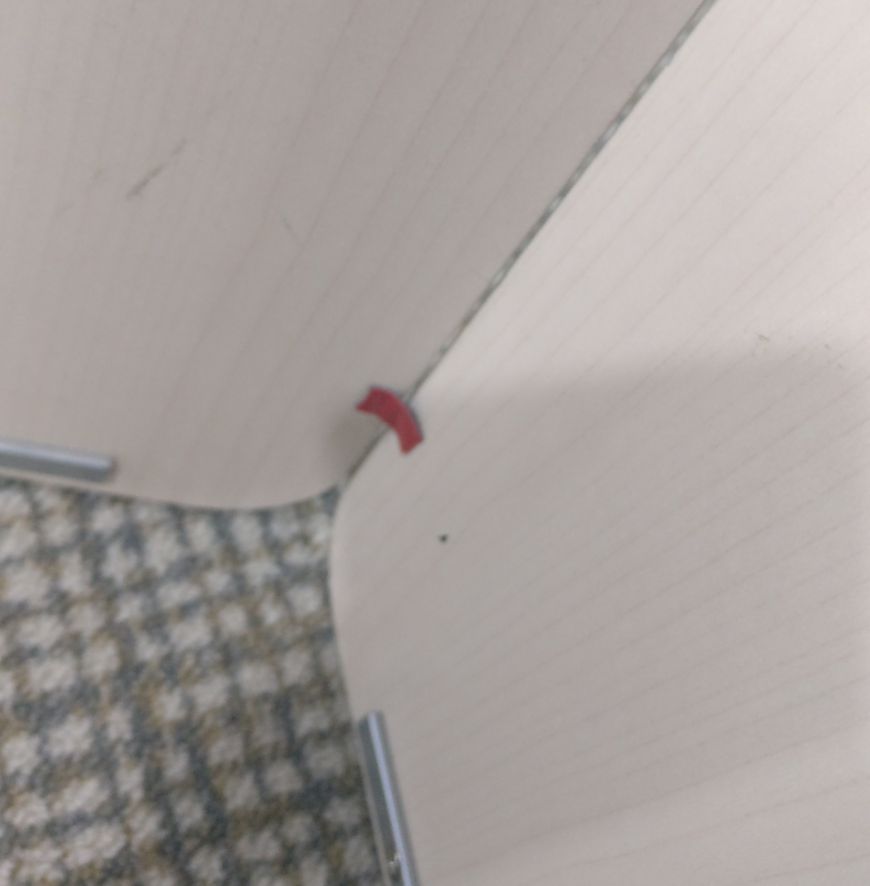
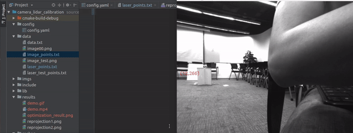
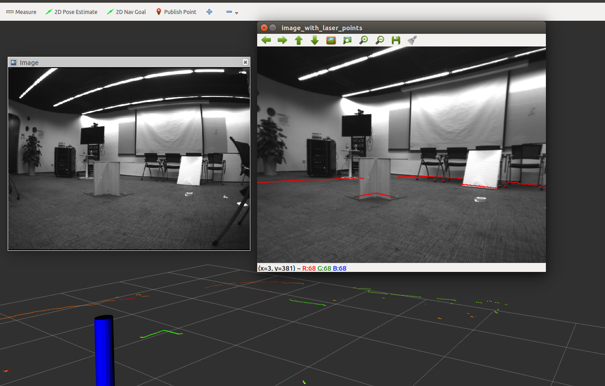

## Camera Lidar Calibration Tool.

Author:xinliangzhong(xinliangzhong@foxmail.com)


### 1.Description
The package is used to calibrate a 2D LiDAR or laser range finder(LRF)
with a monocular camera. Specficially, Hokuyo UTM-30LX have been suscessfully calibrated against a mono camera.

### 2.Prerequisites
We have tested the library in 16.04, but it should be easy to compile in other platforms.

##### OpenCV
We use [OpenCV](http://opencv.org) to manipulate images and features. Dowload and install instructions can be found at: http://opencv.org. **Required at leat 2.4.3. Tested with OpenCV 3.3**.

##### Eigen3
Download and install instructions can be found at: http://eigen.tuxfamily.org. **Required at least 3.1.0**.

##### Ceres
Download and install instructions can be found at: http://www.ceres-solver.org/installation.html.

### 3.How to build

```
mkdir build
cd build
cmake ..
make
```

### 4.How to Prepare the calibration data

We need the 3d points in laser coordination and the same points in the image.
The 3D points (actually z=0) you can put in the ``data/laser_points.txt``;
The 2D points in the image you can put in the ``data/image_points.txt``;
We combine the data in data.txt with 4 cols which represents ``x y u v`` respectively.

**So how to fine the 3D-2D pairs correctly?**
Here we provide a simple way:
Suppose your laser in the horizontal plane, and we just need to measure the height of the laser.
Actually the red point in the following picture is the flag that we tested in our setups.


For the ``x and y``, you can use the rviz (2D nav goal) tool to measure. The result will be show in the terminal.
For the ``u and v`` in the image, we provide a simple tool to detect corners in the rectangle your mouse selected.
and the data will automatically saved in ``data/image_points.txt``.


### 5.Key Algorithm

Actually it just a least square problem.


### 6.Show the reprojection results
``Tcl: which takes a vector from laser to camera.``



### 7.Good luck to you!